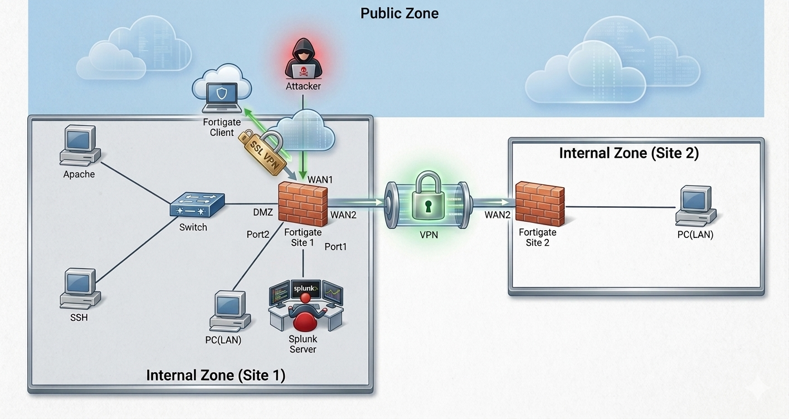

# Secure-Net-Capstone
A secure multi-site enterprise network featuring dual FortiGate firewalls connected via an IPsec Site-to-Site VPN, client-based remote access, and centralized Splunk SIEM logging for simulated cyber attack detection.
# Secure Enterprise Network Architecture: Multi-Site IPsec VPN, SSL-VPN Portal, and Centralized Splunk SIEM Monitoring

## 📌 Project Overview
This repository showcases the end-to-end engineering lifecycle of a hardened, multi-zone enterprise network infrastructure designed for an organization with a corporate Headquarters (Site 1), an operating Branch Office (Site 2), and remote employees needing secure network passage. 

The core architecture implements robust perimeter filtering, encrypted cross-site communication via point-to-point tunnels, role-based remote access gateways, and continuous log forwarding into a centralized Splunk Enterprise SIEM instance. Defensive visibility is validated through active adversary simulations designed to test correlation limits and dashboard notification tracking.

---

## 🏗️ Topology & Network Segmentation Schema

The infrastructure separates corporate boundaries into logical, zone-based network interfaces to completely enforce a zero-trust model and restrict unauthorized lateral movement.

### Subnet Allocation Matrix
| Functional Zone | Network Subnet (CIDR) | Gateway Interface | Primary Hosted Services / Devices |
| :--- | :--- | :--- | :--- |
| **Site 1: Internal LAN** | `192.168.10.0/24` | FortiGate-S1 (Port2) | Core Engineering Workstations, Internal Stations |
| **Site 1: DMZ** | `192.168.2.0/24` | FortiGate-S1 (DMZ) | Public Apache Web Server, OpenSSH Server |
| **Site 1: Management** | `192.168.1.0/24` | FortiGate-S1 (Port3) | Centralized Splunk Indexer Engine, Admin Console |
| **Site 2: Internal LAN** | `192.168.20.0/24` | FortiGate-S2 (Internal) | Branch Workstations, Local Storage Resources |
| **Remote VPN Scope** | `10.8.0.0/24` | FortiGate-S1 (ssl.root) | Dynamic Remote Access Scope (`10.8.0.10 - .50`) |
| **Public Zone (WAN)** | `192.168.64.0/24` | Untrusted Cloud | Kali Linux Attacker Device, Public Portals |

### Infrastructure Diagram
The structural layout across the enterprise zones is documented below:


---

## 🔒 Virtual Private Network (VPN) Architecture

Secure communications across untrusted public boundaries utilize two distinct cryptographic deployment patterns managed across the FortiGate gateways:

### 1. Persistent Site-to-Site IPsec Tunnel
A route-based IPsec VPN tunnel directly bridges internal communication between Head Office (Site 1) and Branch Office (Site 2) across the `wan2` physical interfaces. 
* **Phase 1 Gateway Mappings:** Site 1 Gateway points to `1.1.1.2`; Site 2 Gateway points back to `1.1.1.1`.
* **Cipher Proposals:** Primary negotiation forces `aes128-sha256` / `aes256-sha256` key exchanges with Diffie-Hellman Group 14 to maintain maximum perfect forward secrecy (PFS).
* **Interface Optimization:** `net-device` is explicitly disabled across the appliances to enforce clean, route-based policy handling without virtual interface clutter.

### 2. Client-Based Remote Access SSL-VPN
An enterprise-grade SSL-VPN termination gateway runs on Site 1 to securely ingest remote workforce connections via the FortClient desktop agent.
* **Non-Standard Port Binding:** Bound to TCP port `8080` to hide the gateway from standard script-based scanning hits common on default port 443.
* **Role-Based Access Control:** Unauthenticated users are routed to a basic restricted portal; however, membership verification against the custom `VpnUser` firewall group provisions high-privilege full-access tunnels, leasing dynamic IPs from the `10.8.0.10 - 10.8.0.50` scope.
* **Lateral Containment:** Firewalls enforce policy routing restricting the `ssl.root` landing interface to communicate *only* with the secure engineering subnet (`192.168.10.0/24`) behind `internal2`.

---

## 📊 Centralized SIEM Logging Pipeline

System visibility, threat identification, and audit paths are unified by feeding log data streams straight to a Splunk Server node running on management host `192.168.1.100`.

```text
Telemetry Sources ──► Ingestion Port ──► Splunk Parsing Schema (inputs.conf)
├─ FortiGate Firewalls  ──► UDP 514 / 555 ──► sourcetype=fortigate_log (index=security_appliances)
├─ Linux OS Logs        ──► UF Agent      ──► /var/log/auth.log -> sourcetype=linux_secure
└─ Apache Services      ──► UF Agent      ──► /var/log/apache2/access.log -> sourcetype=access_combined
